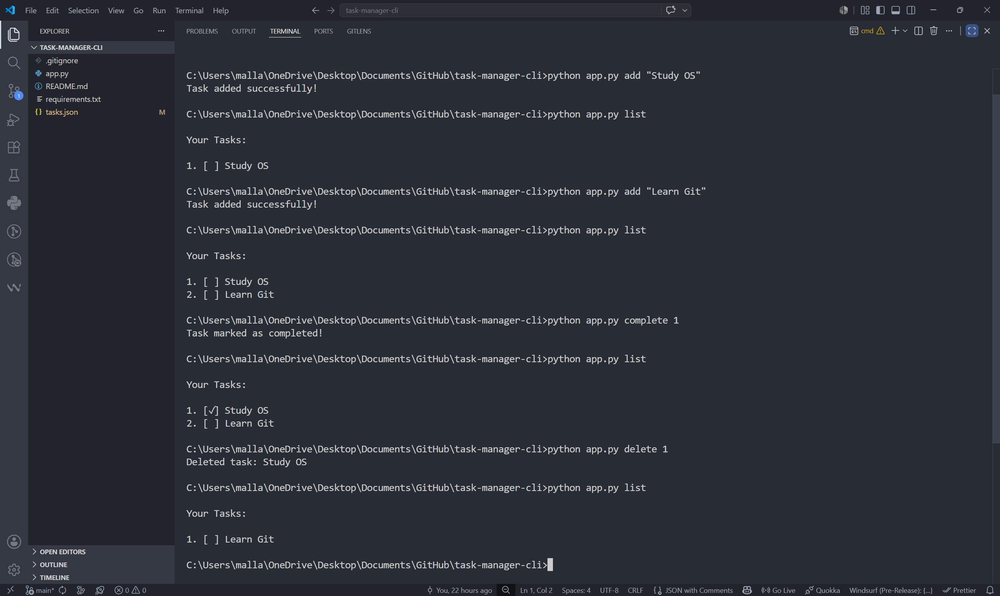

# Task Manager CLI

A simple command-line task manager built with Python.

---

## Features

- Add tasks
- List tasks
- Mark tasks as completed
- Delete tasks
- JSON-based task storage

---

## Technologies Used

- Python
- argparse
- JSON

---

## Project Structure

```plaintext
task-manager-cli/
│
├── app.py
├── tasks.json
├── screenshot.png
├── requirements.txt
├── .gitignore
└── README.md
```

---

## Usage

### Add a Task

```bash
python app.py add "Study OS"
```

Example Output:

```plaintext
Task added successfully!
```

---

### List Tasks

```bash
python app.py list
```

Example Output:

```plaintext
Your Tasks:

1. [ ] Study OS
2. [✓] Learn Python
```

- `[ ]` = Incomplete task
- `[✓]` = Completed task

---

### Complete a Task

```bash
python app.py complete 1
```

Example Output:

```plaintext
Task marked as completed!
```

---

### Delete a Task

```bash
python app.py delete 1
```

Example Output:

```plaintext
Deleted task: Study OS
```

---

## Screenshot



---

## Future Improvements

- Add task timestamps
- Add colored terminal output
- Add unit tests using pytest
- Improve project structure

---

## Author

Sudhishna Mallavarapu